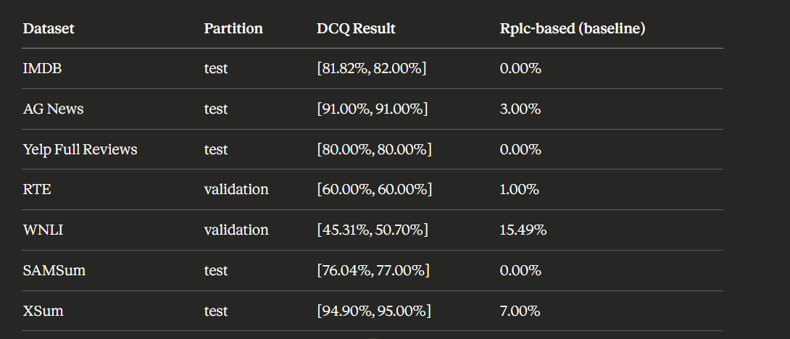

We are gonna test the same 7 models they have tested, but their translation in kazakh and japaneese (originally they have tested 10 models, but 3 models has been tested using fine tuning the models, sowe are gonna skip those 3 models).

So this repo is designed to check whether this method under the same condition ccan detect the contamination of the same benchmarks, but theur translation in kazakh and japaneese(gpt4 to make purtarbations, and gpt4 and gpt3.5 to be checked, we will skip llama open source models for now).

here is result for 7 datasets they detected contamination for, I am going to use the same set up, and those 7 datasets and their translation in kazakh. Later will be upadated with the results in kaz translations
